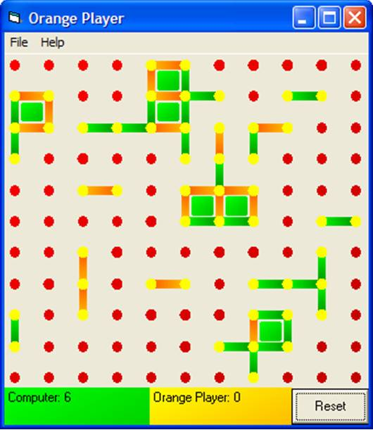



## Dots Game

### Description

This is a computerised version a a game that i used to play at primary school where you have to make squares by connecting dots. It is quite simple and you can play against either the computer or another human player.
 
### More Info
 

             |
---                |---
**Submitted On**   |2005-08-12 10:30:52
**By**             |[jonathan waller](https://github.com/Planet-Source-Code/PSCIndex/blob/master/ByAuthor/jonathan-waller.md)
**Level**          |Beginner
**User Rating**    |4.8 (19 globes from 4 users)
**Compatibility**  |VB 5\.0, VB 6\.0
**Category**       |[Games](https://github.com/Planet-Source-Code/PSCIndex/blob/master/ByCategory/games__1-38.md)
**World**          |[Visual Basic](https://github.com/Planet-Source-Code/PSCIndex/blob/master/ByWorld/visual-basic.md)
**Archive File**   |[Dots\_Game1923858142005\.zip](https://github.com/Planet-Source-Code/jonathan-waller-dots-game__1-62186/archive/master.zip)

